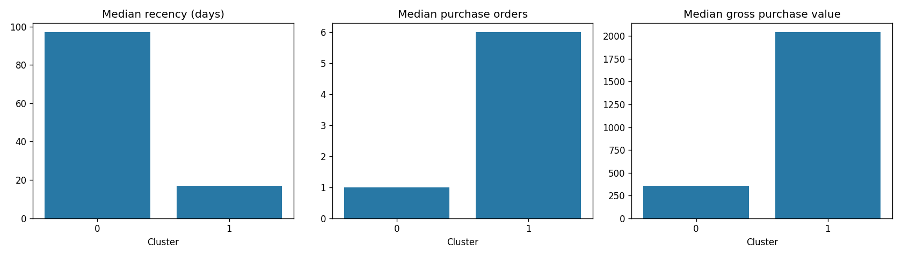
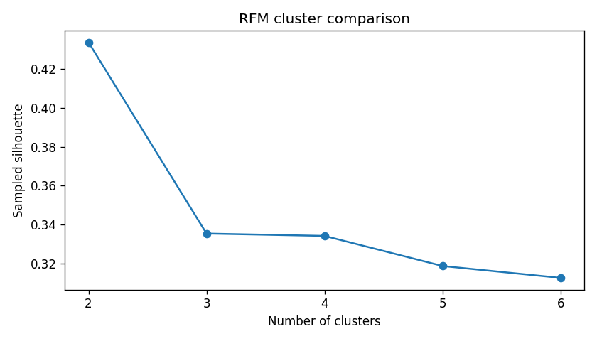
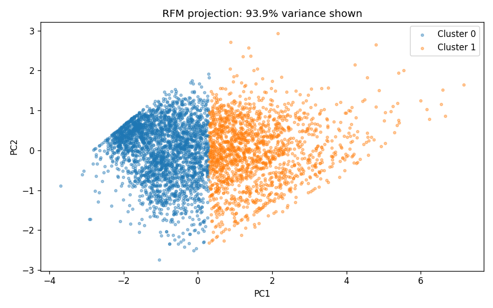

# Customer Segmentation & Purchase Behaviour Analysis

[](https://www.python.org/)
[](https://scikit-learn.org/)
[](https://pandas.pydata.org/)

An exploratory data analytics and customer segmentation project evaluating e-commerce transactional data to analyze customer purchasing patterns, report credit/return behaviors, and evaluate clustering models using **RFM Features (Recency, Frequency, Monetary)**, **K-Means Clustering**, and **Market-Basket Popularity Heuristics**.

---

## 📌 Executive Summary

This analysis processes **541,909 raw transaction records** from an online retail dataset and analyzes **4,334 customers with at least one valid purchase** within the observation window.

### Verified Numerical Highlights
* **Revenue Concentration**: **38.35% of eligible customers** (Cluster 1: Recent, Repeat) account for **84.93% of gross merchandise purchase value** (7,420,418.38 value units).
* **Cluster Selection**: Evaluated candidate values of $K \in [2, 6]$ using Silhouette Scoring and a minimum cluster size threshold ($\ge 5\%$). Two clusters ($K=2$) were selected among tested candidates, achieving a sampled silhouette score of **0.434**. Groups can overlap; no claim of sharply separated customer types is made.
* **Return & Credit Handling**: Observed credit returns ($8,506$ line items totaling 471,750.71 across all identified customers) were analyzed separately from gross positive purchases (8,737,227.64) to maintain accurate purchase metrics while reporting net spend.
* **Model Stability**: Cluster allocations were checked for sensitivity using **Adjusted Rand Index (ARI)** across multiple initialization seeds ($\text{ARI} \ge 0.999$) and 99th percentile feature tail capping ($\text{ARI} = 0.9706$).

---

## 🔍 Segment Overview & Comparison

| Metric / Attribute | Cluster 0 (Value Tier 1: Less Recent, Occasional) | Cluster 1 (Value Tier 2: Recent, Repeat) | Eligible Population Total |
| :--- | :---: | :---: | :---: |
| **Customer Count (% Share)** | 2,672 (61.65%) | 1,662 (38.35%) | 4,334 (100.0%) |
| **Median Recency (Days)** | 97.0 days | 17.0 days | 51.0 days |
| **Median Purchase Orders** | 1.0 order | 6.0 orders | 2.0 orders |
| **Median Gross Value** | 356.92 | 2,041.33 | 662.56 |
| **Median Net Spend** | 349.62 | 1,995.04 | 646.84 |
| **Gross Purchase Value** | 1,316,809.26 (15.07%) | 7,420,418.38 (84.93%) | 8,737,227.64 (100.0%) |
| **Observed Credit Return Value** | 31,886.36 | 435,941.37 | 467,827.73 |
| **Proposed Action Hypothesis** | Test re-engagement messaging; measure incremental purchases | Test loyalty/service offers and monitor repeat purchases | Data-driven evaluation |

---

## 💳 Reconciliation of Return Totals

The analysis outputs report two distinct return credit totals depending on population scope:

1. **471,750.71**: Total absolute return credit value across **all 4,363 identified merchandise customers** (including 29 return-only customers who made no valid purchases in the observation window).
2. **467,827.73**: Total return credit value belonging to the **4,334 purchasing customers** who were eligible for RFM clustering.

*The difference of 3,922.98 represents credit line items from the 29 return-only customers excluded from RFM clustering.*

---

## 🛠️ Data Pipeline & Analytics Architecture

```
┌─────────────────────────┐
│ Raw Transactions (541k) │
└───────────┬─────────────┘
            │
            ▼
┌─────────────────────────┐   - Remove Exact Duplicates (5,268 rows)
│ Audited Cleaning        ├─► - Exclude Missing Customer IDs (135,080 rows)
└───────────┬─────────────┘   - Exclude Non-Merchandise Scope (POST, DOT, M, Fees)
            │
            ▼
┌─────────────────────────┐   - Recency: Days to Reference Date (2011-12-10)
│ RFM Feature Formulation ├─► - Frequency: Distinct Purchase Invoices
└───────────┬─────────────┘   - Gross Monetary: Positive Merchandise Line Values
            │
            ▼
┌─────────────────────────┐   - Log1p Transformation: log(1 + X)
│ Scaling & Clustering    ├─► - StandardScaler Standardization
└───────────┬─────────────┘   - K-Means Candidate Evaluation (K=2..6, Silhouette Scoring)
            │
            ▼
┌─────────────────────────┐   - Segment Profiles & Financial Audits
│ Outputs & Visualizations├─► - Sensitivity Checks (ARI Seed/Cap Validation)
└─────────────────────────┘   - Segment Popularity Recommendation Heuristic
```

---

## 📈 Visualizations & Candidate Evaluation

### 1. Segment Profiles Comparison
Observed medians for recency, order count, and gross purchase value across selected clusters:


### 2. K-Means Silhouette Comparison ($K=2..6$)
Comparing silhouette scores and smallest cluster shares across candidate $K$ values:


### 3. PCA Feature Space Projection
2D projection of standardized $\log(1 + \text{RFM})$ feature space for visual inspection:


---

## 📁 Key Output Files (`outputs/`)

| Output File | Description |
| :--- | :--- |
| [`outputs/customer_segments.csv`](outputs/customer_segments.csv) | Primary customer table with calculated RFM metrics and assigned cluster labels. |
| [`outputs/segment_profiles.csv`](outputs/segment_profiles.csv) | Aggregated medians, totals, value shares, and proposed test actions per cluster. |
| [`outputs/cluster_comparison.csv`](outputs/cluster_comparison.csv) | Candidate evaluation table comparing Silhouette scores, Inertia, and min cluster shares for $K=2..6$. |
| [`outputs/cluster_sensitivity.csv`](outputs/cluster_sensitivity.csv) | Stability check results (Adjusted Rand Index across seeds and 99th percentile tail capping). |
| [`outputs/segment_popularity_recommendations.csv`](outputs/segment_popularity_recommendations.csv) | Heuristic recommendations of up to three unseen popular items per customer. |
| [`outputs/cleaning_audit.csv`](outputs/cleaning_audit.csv) | Stage-by-stage population audit tracking row counts and known customer IDs. |
| [`outputs/findings.md`](outputs/findings.md) | Verified summary document of numerical findings and limitations. |

---

## 💡 Proposed Actions & Testing Hypotheses

1. **Repeat & Loyalty Engagement (Cluster 1)**:
   - *Proposed Action*: Test loyalty or service offers and monitor repeat purchase rates.
   - *Context*: Cluster 1 accounts for **84.93% of gross purchase value**.

2. **Re-Engagement Messaging (Cluster 0)**:
   - *Proposed Action*: Test re-engagement messaging to evaluate whether inactive or occasional buyers respond to outreach.
   - *Context*: Median recency is **97 days** with a median of **1 purchase order**.

3. **Controlled Evaluation Requirement**:
   - Proposed marketing actions are hypotheses for experimentation. Any potential uplift must be measured using a controlled evaluation (A/B testing).

---

## 💻 Installation & Usage

### Prerequisites
- Python 3.10 or higher
- Dependencies listed in `requirements.txt`

### Running the Analysis
1. **Clone the Repository**:
   ```bash
   git clone https://github.com/omrohitchannoji/Customer_segmentation-And-Recommedation-System.git
   cd Customer_segmentation-And-Recommedation-System
   ```

2. **Install Dependencies**:
   ```bash
   pip install -r requirements.txt
   ```

3. **Execute the Notebook**:
   ```bash
   jupyter notebook Customer_Segmentation.ipynb
   ```
   *Note: Place `data.csv` in the repository root directory before executing.*

---

## 📖 Dataset Provenance & Attribution

- **Dataset Reference**: Online Retail Dataset schema (541,909 original transaction rows).
- **Source Documentation**: [UCI Machine Learning Repository: Online Retail](https://archive.ics.uci.edu/dataset/352/online+retail).
- *Provenance Note*: The input was provided as a Latin-1 encoded transaction CSV (`data.csv`). Original upload provenance and currency must be verified against source documentation. Schema matching does not establish provenance.

---

## ⚖️ Limitations & Disclaimers

* **Currency & Provenance**: Unit price values are reported as plain numbers; currency is unverified without original source documentation.
* **Observational Data**: Historical clusters describe past transaction patterns and do not establish causal relationships or churn probabilities.
* **Unmatched Credit Returns**: Negative-quantity credit records are tracked in aggregate within the observation window; they are not matched to original purchase invoices.
* **Recommendation Method**: Recommendations use a segment-popularity heuristic (excluding previously purchased items) and do not represent a trained collaborative-filtering model (e.g., ALS).
